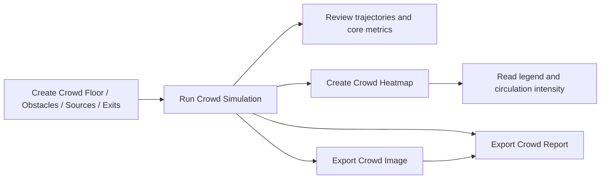

# grasshopper-crowd-flow

[](https://github.com/DariyXYZ/grasshopper-crowd-flow/actions/workflows/build.yml)

Grasshopper plugin for crowd movement simulation and architectural heatmap analysis in Rhino 8.

`GhCrowdFlow` builds a standalone Grasshopper plugin named `Crowd Flow`. Components appear under the `INDTools` tab in the `Crowd` section. It is designed for early-stage architectural studies where you need:

- believable pedestrian trajectories on a 2D floor
- obstacle and wall avoidance
- congestion-aware exit choice
- heatmap mesh outputs for circulation analysis
- a Grasshopper-native workflow without external simulation software

## Quick Start

Requirements:

- Rhino 8 with Grasshopper
- .NET SDK 8
- Windows

1. Build from the repository root:

```powershell
powershell -ExecutionPolicy Bypass -File .\build.ps1
```

2. Deploy the `net48` plugin when Rhino is closed:

```powershell
powershell -ExecutionPolicy Bypass -File .\build.ps1 -DeployToGrasshopper
```

3. Open `tests/grasshopper/crowd/flow-demo/Flow.gh` and, if needed, `tests/grasshopper/crowd/flow-demo/Flow.3dm`.
4. For report export tests, point `Export Crowd Report` to `tests/grasshopper/crowd/flow-demo/CrowdReport_Template.docx`.

The full setup guide is in [docs/quick-start.md](docs/quick-start.md).

## Visual Workflow



## Features

- Crowd floor, obstacle, source, exit, and agent-profile components
- Simulation that runs until agents reach exits instead of stopping at one shared duration
- Per-agent behavioral variation for speed, noise, commitment, congestion sensitivity, wall avoidance, and turn anticipation
- Heatmap mesh generation for occupancy and movement intensity analysis
- Report-oriented metrics such as clearance time, travel-time statistics, and exit split
- Report export workflow with PNG capture and DOCX/PDF generation
- Minimal modern icon set for all crowd nodes

## Repository Layout

- `src/Crowd/` simulation engine and heatmap services
- `src/GrasshopperComponents/` Grasshopper `.gha` plugin with crowd components
- `tests/grasshopper/crowd/flow-demo/` ready-to-open Rhino, Grasshopper, and report-template test files
- `docs/crowd/` crowd-specific architecture, build, debugging, and iteration notes
- `docs/quick-start.md` end-to-end local build, deploy, and first-run guide

## Build

Build from the repository root:

```powershell
powershell -ExecutionPolicy Bypass -File .\build.ps1
```

Build all target frameworks when needed:

```powershell
powershell -ExecutionPolicy Bypass -File .\build.ps1 -AllFrameworks
```

Deploy explicitly when Rhino is closed:

```powershell
powershell -ExecutionPolicy Bypass -File .\build.ps1 -DeployToGrasshopper
```

The main Grasshopper plugin project is:

- `src/GrasshopperComponents/GrasshopperComponents.csproj`

## Current Scope

This public repository currently focuses on crowd simulation only. Broader internal tool categories such as solar, masterplanning, and other IND studio components are intentionally excluded from this repo.

## Development Notes

- The plugin targets `net48`, `net7.0`, and `net8.0`
- Developer-only visibility can be enabled with `GHCROWDFLOW_DEV=1`
- A local developer flag file can also be placed at `%AppData%\\GhCrowdFlow\\dev.flag`
- The release-oriented Grasshopper deploy path is `net48`
- `build.ps1` keeps deploy explicit by default so local verification and release deploy are separate steps
- deploy builds now fail early if Rhino or Grasshopper is still running
- `build.ps1 -DeployToGrasshopper` installs to `%APPDATA%\Grasshopper\Libraries\CrowdFlow\net48`
- `build.ps1 -DeployToGrasshopper` hash-verifies deployed runtime files so a partial copy cannot silently pass as success
- the `Prof` output reports a runtime-resolved engine build marker from the loaded `Crowd.dll` instead of a hardcoded label
- safe parallelization is currently limited to exit-field generation, read-heavy per-agent motion-plan precompute, and final path materialization; movement commit remains sequential to preserve occupancy and collision semantics

## Included Public Test Materials

- `tests/grasshopper/crowd/flow-demo/Flow.gh` sample Grasshopper definition
- `tests/grasshopper/crowd/flow-demo/Flow.3dm` Rhino scene for the sample definition
- `tests/grasshopper/crowd/flow-demo/CrowdReport_Template.docx` report template for export-node testing
- `docs/quick-start.md` user-facing setup walkthrough
- `docs/reporting-workflow.md` reporting and template workflow notes

## Status

This repository is now structured so a public user can build, deploy, open the demo scene, and test the reporting workflow locally. The remaining release work is packaging polish and final GitHub publication.
